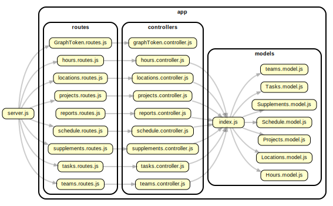
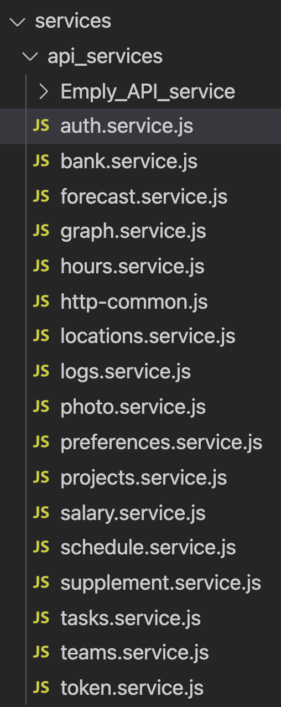

# SRC

The `src/` folder acts just like any other react project.
With the help of React Router Dom.

These different pages make use of the reusable components, but have a lot of logic and extensive state management to them and therefore are not very reusable, they can also have their own component folder in order to make use of state management hierarchy.

Most components used in the application are reusable ones, found in the `src/App/components/` folder. Here the components are passed down to each tab from the `src/App/App.js`. Beware though, some tabs might require "Services", information or other components passed down to them, so make sure to weave down the necessary things needed, into them.

# Modals

You can make use of Modals when possible, Modals can be used anywhere in the project because they are detached from the Tabs. More information on how the modals work and are coded please navigate to `src/App/components/Modals/`.

## MUI Modals

Since I added Material UI components to the application, using MUI modals is easier and than the custom modals explained above.

# API

This companion app is made with javascript Node.js, the server is created using express and the API is created using Express Router and the database tool is [Sequelize](https://sequelize.org/).

Find the API here [API](https://github.com/ingimar-eyfjord/NodeJs_Express_JWT_API_Sequalize_MongoDB_Websockets).

- The API communicates with a MySQL and MongoDB databases.

- Here you can see the overview of the structure of the API.



# Global Store (Redux)

The global store is a custom built Context/Reducer global state managment component in this app. Using the createContext and useReducer from React, we can create a context and a provider based state managment that encaptulates the application.

- Reducer takes the old state and action as an argument and returns a new state as an object.

- Find the store here [src/context/store.js](src/context/store.js).

```js
import React, { createContext, useReducer } from "react";
const initialState = {};
export const GlobalState = createContext(initialState);
export const StoreProvider = ({ children }) => {
  const Reducer = (state, action) => {
    const name = Object.keys(action);
    const values = Object.values(action);
    return { ...state, [name]: values[0] };
  };
  const [state, dispatch] = useReducer(Reducer, initialState);
  return (
    <GlobalState.Provider value={[state, dispatch]}>
      {children}
    </GlobalState.Provider>
  );
};
```

## Accessing, using and updating the store

Here is an explination on how to use the global store in any component.

```js
// Import both useContext and the GlobalState
import { useContext, useEffect } from "react";
import { GlobalState } from "store";

export function StoreExample() {
  //Define Store using useContext
  const [Store, setStore] = useContext(GlobalState);

  // Inside useEffect or any callback function simply add an object into setStore method.
  useEffect(() => {
    const example_data = {
      Name: "Ingimar Eyfjord Smarason",
      Age: 28,
      Nationality: "Icelandic",
      JobTitle: "Senior consultant - IT development",
    };
    setStore({ Employee: example_data });
    return () => {
      // Cancel subscribtion
    };
  }, []);
  // Access Store.Employee
  return (
    <div>
      <p>{Store.Employee.Name}</p>
      <p>{Store.Employee.Age}</p>
      <p>{Store.Employee.Nationality}</p>
      <p>{Store.Employee.JobTitle}</p>
    </div>
  );
}
```

- Find the store here `src/context/store.js`.

# Services

The `src/services/` folder contains the fetch functions (Promise based HTTP). We use this service to communicate with the API. I use [Axios](https://github.com/axios/axios) for this.

The class methods are imported when needed to fetch data from the database.
The naming convention of the different files/classes relates to the different tables existing in the database.

## How to use Axios

<p>
- Folder structure of the services
  
</p>

- Initiate an instance of axios with the `axios.create` method.

```js
import axios from "axios";

const instance = axios.create({
  baseURL: "https://api-dev.dialogueone.com/api",
  headers: {
    "Content-type": "application/json",
  },
});

export default instance;
```

- Import axios inside a service and create a class with methods. Then export the class

```js
import http from "./http-common";

class EmployeeService {
  // Async/await based
  async getAll() {
    const response = await http.get(`/Employee`);
    return response.data;
  }
  // promise based
  get(id) {
    return http.get(`/Employee/${id}`);
  }
  create(data) {
    return http.post("/Employee", data);
  }
  update(id, data) {
    return http.put(`/Employee/${id}`, data);
  }
  delete(id) {
    return http.delete(`/Employee/${id}`);
  }
}
export default new EmployeeService();
```

- Use a service inside a component

```js
// Import both useContext and the GlobalState
import { useContext, useEffect, useCallback } from "react";
import { GlobalState } from "store";
import EmployeeService from "services/api_services/employee.service.js";
export function StoreExample(props) {
  //Define Store using useContext
  const [Store, setStore] = useContext(GlobalState);

  const getEmployee = useCallback(
    async (id) => {
      let employee = await EmployeeService.get(id);
      setStore({ Employee: employee });
    },
    [setStore]
  );

  useEffect(() => {
    getEmployee(id);
    return () => {
      // Cancel subscribtion
    };
  }, [props.id]);
  // Access Store.Employee
  return (
    <div>
      <p>{Store.Employee.Name}</p>
      <p>{Store.Employee.Age}</p>
      <p>{Store.Employee.Nationality}</p>
      <p>{Store.Employee.JobTitle}</p>
    </div>
  );
}
```


# Authentication

- The user is authenticated using the [MSAL2 Provider](https://docs.microsoft.com/en-us/graph/toolkit/providers/msal2) and [Microsoft Graph Toolkit React components](https://docs.microsoft.com/en-us/graph/toolkit/get-started/mgt-react).

The index component imports the Authenticate component, which handles the authentication for the application.
- `index.js`
```js
import React from "react";
import ReactDOM from "react-dom";
import Authenticate from "./authenticate";
import { StoreProvider } from "context/store.js";
import "./index.css";

ReactDOM.render(
  <React.StrictMode>
    <StoreProvider>
      <Authenticate></Authenticate>
    </StoreProvider>
  </React.StrictMode>,
  document.getElementById("root")
);
```

A useEffect that sets the configuration for the Msal2Provider global provider.
- `authenticate.jsx`
```js


import React, { useEffect, useState, useContext, useCallback } from "react";
import { Login } from "@microsoft/mgt-react";
import { GlobalState } from "store";
import { Providers, ProviderState } from "@microsoft/mgt";
import { Msal2Provider } from "@microsoft/mgt-msal2-provider";
import AuthService from "services/api_services/auth.service";
import App from "./App/App";

function useIsSignedIn() {
  const [isSignedIn, setIsSignedIn] = useState(false);
  useEffect(() => {
    const updateState = () => {
      const provider = Providers.globalProvider;
      setIsSignedIn(provider && provider.state === ProviderState.SignedIn);
    };
    Providers.onProviderUpdated(updateState);
    updateState();
    return () => {
      Providers.removeProviderUpdatedListener(updateState);
    };
  }, []);
  return [isSignedIn];
}

export function Authenticate() {
  const [Store, setStore] = useContext(GlobalState);
  const [isSignedIn] = useIsSignedIn();
  const [AppComp, setApp] = useState(<div>Loading</div>);
  ...
useEffect(() => {
      /// ? old teams login if ends
      const Scopes = [
        "Calendars.Read",
        "Directory.AccessAsUser.All",
        "Directory.Read.All",
        "email",
        "Mail.Read",
        "Group.Read.All",
        "Group.ReadWrite.All",
        "GroupMember.Read.All",
        "GroupMember.ReadWrite.All",
        "Mail.ReadBasic",
        "offline_access",
        "openid",
        "People.Read.All",
        "Presence.Read",
        "Presence.Read.All",
        "profile",
        "Sites.Read.All",
        "Tasks.Read",
        "Tasks.ReadWrite",
        "User.Read",
        "User.Read.All",
        "User.ReadBasic.All",
        "User.ReadWrite",
        "User.ReadWrite.All",
      ];
      const config = {
        redirectUri: `${window.location.origin}`,
        authority:
          "https://login.microsoftonline.com/dd9fe8e0-ee42-4b62-b9a4-b796431bfdfe",
        cache: {
          cacheLocation: "localStorage",
          storeAuthStateInCookie: true,
        },
        scopes: Scopes,
        cacheLocation: "localStorage",
        storeAuthStateInCookie: true,
        clientId: "380f1112-8e95-4f6e-bd18-9a3e44ca9272",
      };
      Providers.globalProvider = new Msal2Provider(config);
    }, []);
  ...
}

```
- Another useEffect has a isSignedIn dependancy, so when isSignedIn is updated it calls the getToken callback function which uses the MSAL global provider predifined getAccessToken function to retrieve the Microsoft Bearer token.

- The same function the calls the AuthService  the Express API JWT authentication methods, effectively signing the user in with their Outlook account and adding an authentication to the API.

- `authenticate.jsx`

```js
...
export function Authenticate() {
 ...
  const getToken = useCallback(async () => {
    let token;
    try {
      token = await Providers.globalProvider.getAccessToken({
        scopes: ["User.Read"],
      });
    } catch (error) {
      return;
    }

    try {
      await AuthService.login(token);
    } catch (error) {
      return;
    }

    const user = AuthService.getCurrentUser();

    setStore({
      UserDetails: {
        UserUUID: user.id,
        UserEmail: user.email,
        UserName: user.name,
      },
    });

    setApp(<App></App>);
    // console log master data inside a table
  }, [setStore]);

  useEffect(() => {
    if (isSignedIn) {
      getToken();
    }
    // eslint-disable-next-line
  }, [isSignedIn]);

  if (isSignedIn) {
    if (Store.UserDetails) {
      return (
        <React.Suspense fallback={<div> Loading</div>}>
          {AppComp}
        </React.Suspense>
      );
    } else {
      return (
        <div className='NotAuthorized'>
          <div>Please wait</div>
        </div>
      );
    }
  }
  if (!isSignedIn) {
    return (
      <div className='NotAuthorized'>
        <div className='logo'>
          <div className='logoForHeader'></div>
        </div>
        <h3>Welcome to Dialogue Time</h3>
        <Login></Login>
      </div>
    );
  }
}
export default Authenticate;
```


# Functions

The `src/App/Function/` folder contains reusable functions that are necessary to keep consistency throughout the application.
The `src/App/Function/converterClass.js` for example contains functions used to convert data to the necessary formats before communicating with the database.

## Things to keep in mind

- Modals are also used in this project, they are reusable components that can receive information.

- When making components try to make them reusable

- Components might need specific data passed down to them as props. It's best to minimize this as the dependancies can cause unnecessary rerenders.
